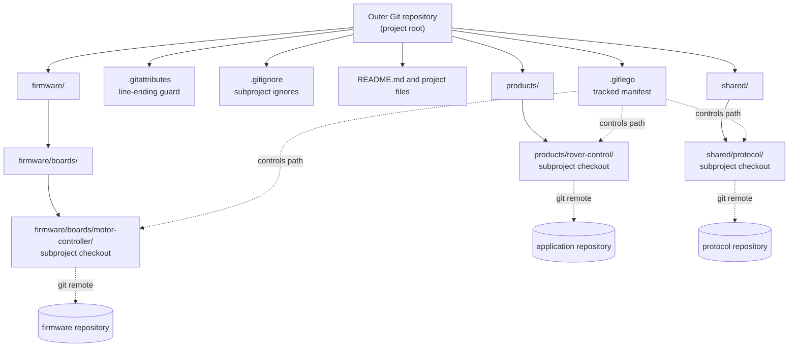
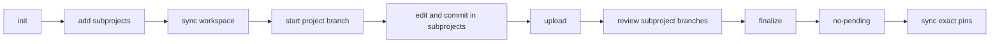
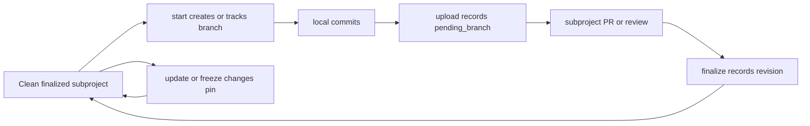

# git-lego

Version 0.7.1<br>
**Copyright (c) 2026 Flemming Steffensen**<br>
License: MIT License<br>
SPDX-License-Identifier: MIT<br>

`git-lego` is a small multi-repository workspace tool for managing many individual Git repositories as a single cohesive project. It is designed for modularized codebases where different parts of a project are kept in separate repositories.

Inspired by Android [`repo`](https://source.android.com/docs/setup/reference/repo), git-lego focuses on the features most useful with ordinary Git hosting and can support pull-request-based workflows out of the box. It is intended as a practical improvement over manually coordinating multiple repositories, while avoiding the complexity and common workflow problems associated with Git submodules, Git subtree, and Git subrepos.

A project root repository contains a manifest with references to the repositories in the project. This allows setup files, glue code, scripts, and documentation to live in the root repository, while `git-lego` checks out the referenced subprojects at their recorded paths and revisions. Nested projects are supported as well, allowing one subproject to contain its own manifest and child subprojects.

Documentation map:

- This `README.md` is the user manual. It explains the motivation, requirements, installation, workspace layout, commands, examples, CI usage, and comparisons with submodules, subtrees, and git-subrepo.
- [`docs/implementation-summary.md`](docs/implementation-summary.md) is the concise implementation reference. It records the current behavior contract, manifest fields, command guarantees, error handling, and test coverage.
- [`docs/prioritized-gaps.md`](docs/prioritized-gaps.md) tracks larger reliability or workflow gaps that need separate design work.
- [`MANIFEST.md`](MANIFEST.md) documents `.gitlego` manifest schema version 1.
- [`version.md`](version.md) lists release-level changes.

## Current 0.7 Capabilities

The project has changed substantially since the 0.4 series. The current tool is no longer just an init/add/start/upload/finalize/sync wrapper; it also includes:

- the `git-lego` rename from the earlier `git-stack` name, with project/subproject terminology replacing stack/module terminology;
- manifest schema validation, `.gitlego.lock` protection for manifest writers, `.gitlego` LF normalization, and `.gitignore` guards for nested `.git` directories;
- script-facing porcelain and JSON output for status-style commands, plus documented exit-code conventions;
- workspace maintenance commands such as `remove`, `rm`, `mv`, `clone`, `freeze`, `config`, `diff`, `foreach-modified`, and `foreach-clean`;
- shell completion generation for Bash, Zsh, and Fish;
- source export through `export`, including `MANIFEST.lock`, deterministic archive options, and dirty-worktree protection;
- project-boundary-safe `extract` and `absorb` workflows for moving source between the outer repository and managed subprojects;
- `doctor` for environment/workspace preflight checks, plus dry-run planning for `sync`, `snapshot`, `upload`, and `finalize`.

When upgrading an older workspace, review `.gitlego` changes carefully, run `git-lego verify`, and prefer `git-lego sync` before editing subprojects. Older command names such as `available`, `record`, and `check` have been replaced by `outdated`, `snapshot`, and `no-pending`.

## Shared Source Without Repository Drama

`git-lego` is for projects that share source code across several normal Git repositories without turning that shared source into opaque packages or copying it into every consumer. It is a low-friction, developer-administered method: an outer repository records the project shape, and subprojects remain editable Git repositories with their own branches, remotes, history, and reviews.

The mental model is close to package references, but with source code. A project pins the version of each shared component in `.gitlego`; `git-lego sync` materializes those subprojects; `git-lego outdated` checks whether upstream subproject branches have moved; `git-lego update` changes a selected subproject version when you want that movement. Unlike a binary package reference, the checked-out subproject is still source that can be edited, tested, committed, and reviewed in its own repository.

This keeps project administration visible. Toolchain files, build glue, product documentation, and the manifest live in the outer repository. Reusable source lives in subprojects. A branch can contain both code changes and the manifest update that records the intended combined workspace state.

Ticket-style branch names such as `XX-123-short-description` are optional, but git-lego can use them to automate project ids and conservative finalize lookups. It does not require a particular merge strategy; explicit finalization works with merge commits, rebase merges, squash merges, tags, or pinned revisions.

`git-lego` does not create pull requests itself. It prepares consistent branches and manifest state, then optionally allows tools such as Azure CLI, GitHub CLI, GitLab CLI, or repository scripts create PRs explicitly.

## Alternatives And Tradeoffs

### Monorepo
A [monorepo](https://en.wikipedia.org/wiki/Monorepo) is often the simplest answer when one organization owns the code, build, permissions, and release cadence. The friction starts when shared components need independent ownership, independent history, different access rules, or reuse by projects that should not inherit the whole repository.

`git-lego` keeps those components in separate repositories while giving developers one materialized workspace and one project-level manifest.

### Git Submodules

[Submodules](https://git-scm.com/book/en/v2/Git-Tools-Submodules) are built into Git and are good for pinning external repositories. Their common pain is workflow overhead: contributors need submodule-specific commands, parent reviews often show only a gitlink pointer change, and cross-repository work is easy to split incorrectly between the submodule and the parent.

`git-lego` makes the manifest a normal text file, keeps subproject paths ignored by the outer repository, and provides explicit commands for syncing, publishing subproject work, finalizing landed changes, and checking outdated upstream movement.

### Git Subtree

[Subtree](https://github.com/git/git/blob/master/contrib/subtree/git-subtree.txt) is useful when vendored source should become part of one repository's history and review flow. The tradeoff is that ownership boundaries blur: copied source lives in the consumer repository, history grows there, and upstream contribution requires subtree discipline.

`git-lego` does not vendor subproject source into the outer repository. Subprojects stay as standalone repositories, and the outer repository records which subproject revisions belong to the project.

### git-subrepo

[`Subrepo`](https://github.com/ingydotnet/git-subrepo) improves the copied-source model by adding commands and metadata for pulling from and pushing back to an upstream repository. It is a good fit when the consumer repository should contain the source directly, but still needs a path back upstream.

`git-lego` chooses a different model: source is not copied into the outer repository at all. Developers work in real nested repositories, and the manifest records the combined project state.

### Android repo

Android [`repo`](https://source.android.com/docs/setup/reference/repo) is powerful and proven for AOSP-scale workspaces. It is also tailored to Android's ecosystem, XML manifests, and Gerrit-centered workflows.

`git-lego` borrows the useful workspace idea but keeps the shape narrower: plain Git remotes, a readable `.gitlego` manifest, and commands that fit pull-request-based or script-driven project administration.

## Comparison

| Topic | Monorepo | Submodules | Subtree / subrepo | git-lego |
| --- | --- | --- | --- | --- |
| Best fit | One shared ownership boundary | Source in pinned external repositories | Vendored source in one repository | Easy shared source across many normal repositories |
| Source location | One repository | Nested repository checkout | Copied into consumer history | Nested subproject repository |
| Project state | Repository commit | Gitlink plus `.gitmodules` | Consumer commits plus metadata | Text entries in `.gitlego` |
| Get workspace | Clone once | Clone plus submodule init/update | Clone once | Clone outer repo, then `git-lego sync` |
| Check upstream movement | Normal Git history | Submodule commands/manual checks | Pull/sync helper commands | `git-lego outdated` |
| Inspect combined history | Normal Git log | Per-repository logs | Consumer repository log | `git-lego log` |
| Export review/build snapshot | Use repository archive | Custom recursive archive | Repository archive | `git-lego export` with `MANIFEST.lock` |
| Developer shell support | Native Git | Native Git plus submodule commands | Tool-specific | `git-lego completion` |
| Publish shared changes | Push same repository | Push subproject, update then push parent  | Push consumer; optionally push upstream | `git-lego upload --finalize`<br>`git-lego upload`, PR, `git-lego finalize` |
| Main admin cost | Repository scale and access control | Submodule workflow knowledge | Vendored history discipline | Small tool and explicit manifest workflow |

## Requirements

This section is intentionally short until the project has its own public GitHub or Codeberg repository with installation packages or release artifacts.


- Git.
- A POSIX-like shell for `bin/git-lego`; Git Bash is the normal Windows runtime used by `bin/git-lego.bat`. BusyBox `sh` compatibility is tested when BusyBox is available.
- Read access to every subproject repository listed in `.gitlego`.
- Write access to subproject repositories only when using `upload`.
- `git-lego` on `PATH`, or invoked directly from the checkout.
- Optional: `git-filter-repo` only when using `extract --preserve-history`.

Credential handling is delegated to Git. Does not store provider tokens in `.gitlego`.

## Installation And Invocation

Put `bin/` on `PATH` so the executable name `git-lego` is discoverable:

```sh
export PATH="$PWD/bin:$PATH"
```

Because the executable follows Git's external-command naming pattern, both forms work when `bin/` is on `PATH`:

```sh
git-lego status
git lego status
git lego help
```

Use `git-lego --help` for direct help output. Git may intercept `git lego --help` for its own manpage lookup before invoking external commands.

On Windows, `bin/git-lego.bat` locates Git Bash and forwards to the shell implementation. It first looks for `git-lego` next to the `.bat` file, then searches `PATH`. When executed by `sh` or Bash on Linux, macOS, or Git Bash, the same `.bat` file falls through to its shell fallback and executes the adjacent `git-lego` script.

Most commands may be run from the project root, a normal subdirectory, or deep inside a checked-out subproject. `git-lego` walks upward to find `.gitlego`, then runs from that project root.

You can also run directly from a checkout:

```sh
sh bin/git-lego --help
sh bin/git-lego version
```

### Shell Completion

Generate shell completion scripts with `git-lego completion <shell>`:

```sh
git-lego completion bash > /etc/bash_completion.d/git-lego
git-lego completion zsh > "${fpath[1]}/_git-lego"
git-lego completion fish > ~/.config/fish/completions/git-lego.fish
```

The generated scripts complete command names, common command flags, and subproject paths from the nearest `.gitlego`.

## Workspace Model

A workspace has:

- an outer Git repository
- `.gitlego` tracked by the outer repository, using manifest schema `version=1`
- optional `.gitlego-rc` for local git-lego configuration; `rc` is used in the usual "run/configuration commands" sense
- a managed `.gitattributes` block that pins `.gitlego`, `.gitlego-rc`, and git-lego scripts to cross-platform line endings
- `.gitignore` entries that ignore subproject contents
- one nested Git repository per subproject

The manifest is extension-friendly: git-lego validates and rewrites the sections and keys it owns, while preserving unknown sections and unknown keys where practical.

Terminology:

- **project root**: the workspace directory that contains `.gitlego`; all subproject paths are relative to this directory.
- **outer repository**: the Git repository at the project root. It owns `.gitlego`, `.gitignore`, toolchain project files, local glue code, and documentation. `.gitlego-rc` is local optional configuration.
- **subproject**: a nested Git repository managed by git-lego.
- **subproject repository**: the remote/source repository behind a subproject.
- **subproject path**: the checkout path recorded in `.gitlego`, relative to the project root.

The outer repository tracks coordination files and local workspace files. Source that is shared with other projects usually remains in subprojects.



Example project:

```text
acme-robot-project/                         # outer repository
  .gitlego                                  # tracked manifest for all subprojects
  .gitlego-rc                               # optional local machine configuration
  .gitignore                              # ignores checked-out subproject contents
  README.md                               # outer workspace documentation

  products/
    rover-control/                        # subproject: application repository
      src/
      tests/

  firmware/
    boards/
      motor-controller/                   # subproject: board firmware repository
        src/
        include/

  shared/
    protocol/                             # subproject: shared protocol repository
      schema/
      generators/

  tools/
    release/
      ci-scripts/                         # subproject: build/release tooling repository
        pipelines/
        scripts/

  third_party/
    compression/
      zlib/                               # subproject: external dependency, often partial-cloned
        CMakeLists.txt
```

Each subproject directory is its own Git repository with its own `.git`, branches, commits, remotes, and review flow. Subproject paths in `.gitlego` are always relative to the project root, even when commands are run from deep inside a subproject.

### Nested Projects

A subproject may itself contain a `.gitlego` file. In that case it is a nested project.

By default, `git-lego` uses the nearest `.gitlego` found by walking upward from the current directory. If you run a command inside a nested project, that command operates on the nested project. If you run from the parent project root, the command operates on the parent project.

Workspace-wide state commands that can safely include nested projects support `--recursive`:

```sh
git-lego status --recursive --porcelain
git-lego outdated --recursive --porcelain
git-lego verify --recursive
```

Without `--recursive`, recursive-capable commands print a `Notice:` when they discover nested projects so you can choose whether to include them. `no-pending` is scoped to the current project; run it from each nested project that has its own merge gate.

Write-side commands operate only on the current project boundary. From the parent project, commands such as `add`, `remove`, `mv`, `config`, `update`, `finalize`, `snapshot`, `freeze`, `extract`, and `absorb` refuse paths inside a nested project. Run the command from inside the nested project instead, or use `snapshot --recursive` when the operation is specifically a recursive local manifest refresh. Current-project commands such as `diff`, `foreach-*`, and `export` stay scoped to the project where you run them.

Subproject paths passed to write-side commands must use forward slashes, even on Windows. For example, use `libs/foo`, not `libs\foo`. Backslash paths are refused with exit code 2 so the manifest's canonical path form stays clear when users grep or edit `.gitlego` by hand.

The matching manifest entries would use the same relative paths:

```ini
[subproject "products/rover-control"]
repo=https://example.invalid/acme/rover-control.git
target_branch=main

[subproject "firmware/boards/motor-controller"]
repo=https://example.invalid/acme/motor-controller.git
target_branch=main

[subproject "shared/protocol"]
repo=https://example.invalid/acme/protocol.git
target_branch=main

[subproject "tools/release/ci-scripts"]
repo=https://example.invalid/acme/ci-scripts.git
target_branch=main

[subproject "third_party/compression/zlib"]
repo=https://example.invalid/mirror/zlib.git
clone=partial
target_branch=main
```

Embedded toolchain workspace:

```text
motor-drive-workspace/                         # outer repository
  .gitlego
  .gitlego-rc
  .gitignore
  README.md

  e2studio/
    motor_drive_app/                           # E2Studio project files owned by outer repo
      .project
      .cproject

  ccs/
    motor_drive_app/                           # CCS project files owned by outer repo
      .project
      .cproject

  talia/
    motor_drive_app/                           # Talia project files owned by outer repo
      motor_drive_app.talia

  glue/
    board_startup/                             # local startup and toolchain glue
      startup.c
      linker_sections.ld

  config/
    pinmux/                                    # local board configuration
      motor_drive_pins.yaml

  src/
    shared/
      platform/
        hal/                                   # subproject: hardware abstraction layer
      comms/
        canopen/                               # subproject: CANopen project
      motor/
        control/                               # subproject: motor-control algorithms

  projects/
    static_libs/
      math/
        fixed_point/                           # subproject used by static-library projects
      drivers/
        sensors/                               # subproject used by static-library projects
```

In this layout, the outer repository owns the toolchain-specific project files and any project glue needed to make E2Studio, CCS, and Talia consume the same source tree. The shared source code is inserted as subprojects at the paths expected by those project files. A static-library project may include source from several subprojects, such as `fixed_point` and `sensors`.

The matching manifest entries are still ordinary `[subproject "..."]` sections:

```ini
[subproject "src/shared/platform/hal"]
repo=https://example.invalid/embedded/hal.git
target_branch=main

[subproject "src/shared/comms/canopen"]
repo=https://example.invalid/embedded/canopen.git
clone=partial
target_branch=main

[subproject "src/shared/motor/control"]
repo=https://example.invalid/embedded/motor-control.git
target_branch=main

[subproject "projects/static_libs/math/fixed_point"]
repo=https://example.invalid/embedded/fixed-point.git
target_branch=main

[subproject "projects/static_libs/drivers/sensors"]
repo=https://example.invalid/embedded/sensor-drivers.git
target_branch=main
```

## Manifest States

Pending subprojects represent work that has been pushed for review:

```ini
[subproject "libs/foo"]
repo=https://example.invalid/foo.git
target_branch=main
pending_branch=XX-123-short-description
base_revision=abc123
pushed_commit=def456
```

Finalized subprojects point to integrated commits:

```ini
[subproject "libs/foo"]
repo=https://example.invalid/foo.git
revision=def456
```

A finalized subproject may also record a tag:

```ini
tag=v1.2.3
revision=def456
```

## Typical Workflow



```sh
git-lego init
git-lego add https://example.invalid/foo.git libs/foo
git-lego outdated
git-lego start XX-123-short-description --stash-dirty

# edit and commit inside libs/foo
git-lego upload

# optional explicit PR creation through provider tools or scripts
git-lego foreach-pending -- scripts/create-subproject-pr.sh
scripts/create-outer-pr.sh

# after subproject PRs land
git-lego finalize libs/foo --revision <merged-sha>
git-lego no-pending
git-lego sync
```

Example pending-to-finalized state:



For projects that do not need a separate subproject PR step, upload and pin the pushed subproject commits directly:

```sh
git-lego upload --finalize
git-lego no-pending
git-lego sync
```

## CI And Build Servers

Most CI systems should check out the outer repository normally, then hand over to git-lego to materialize the subprojects:

```sh
git-lego sync
git-lego verify
```

The runner needs Git, git-lego, and credentials that can read every subproject repository. If the build only needs exact checked-out versions, force lightweight clones on the build machine with `.gitlego-rc`:

```ini
[clone]
mode=partial
```

Use `mode=full` on backup or archive machines that should fetch complete subproject repositories. Use `mode=manifest` when CI should honor each subproject's `clone=` setting from `.gitlego`.

For locked-down build hosts that should not have Git or repository secrets, split the pipeline into two jobs:

1. Source assembly job:
   - runs on a runner with Git, git-lego, and repository credentials;
   - checks out the outer repository;
   - runs `git-lego sync`;
   - runs `git-lego verify`;
   - publishes the complete workspace as a pipeline artifact.
2. Build job:
   - downloads the assembled workspace artifact;
   - runs only the compiler/toolchain;
   - does not need Git, git-lego, or repository credentials.

This generic pattern works with Azure DevOps, GitHub Actions, GitLab CI, Gitea, Jenkins, TeamCity, Bamboo, and similar systems. Provider-specific extensions are intentionally not required for v0.7; pipeline examples should be thin wrappers around `git-lego sync` and `git-lego verify`.

## Command Symmetry

Most git-lego commands are paired around one reversible workflow idea: materialize exact source, change source deliberately, then either publish, pin, or back out the workspace shape.

| Intent | Command | Symmetric or follow-up command | Notes |
| --- | --- | --- | --- |
| Create or repair workspace metadata | `init` | `doctor` | `doctor` reports health; `init` repairs the managed `.gitattributes` block. |
| Add or remove a subproject | `add` | `remove` / `rm` | `remove --keep-files` detaches without deleting the checkout. |
| Rename or retarget a subproject | `mv <old> <new>` | `mv --url <url> <path>` | Path moves update checkout, manifest, and ignore entries; URL moves update the manifest URL only. |
| Materialize a workspace | `sync` | `export` | `sync` recreates the working checkout; `export` creates a review/build snapshot with `MANIFEST.lock`. |
| Inspect local state | `status`, `verify`, `doctor` | `no-pending` | `status` reports current state, `verify` checks manifest consistency, `no-pending` is the merge gate. |
| Inspect upstream movement | `outdated` | `update` | `outdated` is read-only; `update` pins one selected subproject to a newer revision, tag, or target head. |
| Start coordinated work | `start` | `snapshot` | `start` creates or records branches; `snapshot` refreshes local manifest state without pushing. |
| Publish or finish work | `upload` | `finalize`, `cleanup-branches` | `upload` records pending state by default; `finalize` pins merged work; cleanup removes local branch hints. |
| Pin current checkouts | `freeze` | `update` | `freeze` records current checkout SHAs; `update` deliberately changes one recorded pin. |
| Convert repository shape | `extract` | `absorb` | `extract` turns outer-repo files into a subproject; `absorb` turns a subproject back into outer-repo files. |
| Install local automation | `install-hooks` | `remove-hooks` | Hooks only run `snapshot --quiet`; they do not upload or create PRs. |
| Iterate subprojects | `foreach`, `foreach-pending` | `foreach-modified`, `foreach-clean` | Selection commands expose the same environment variables for scripts. |

Dry-run symmetry is intentionally limited to commands where the implementation can show planned writes without performing them. `sync`, `snapshot`, `upload`, and `finalize` support `--dry-run` in 0.7.1; `freeze`, `extract`, and `absorb` already support it from 0.7.0. No `--dry-run` is added to `add`, `remove`, `mv`, `start`, or `update` in 0.7.1.

## Commands

Dry-run commands do not run `git fetch`. When a dry-run needs current remote SHA information, git-lego uses read-only `git ls-remote`; if a check genuinely cannot be answered without a real fetch, dry-run marks that field as unknown and notes that the real run would fetch first.

| Command | Reads manifest | Writes manifest | Modifies working tree | Contacts remote | Requires clean state |
| --- | --- | --- | --- | --- | --- |
| `init` | no | yes | no | no | no |
| `add` | yes | yes | yes, clones | yes | no |
| `remove` / `rm` | yes | yes | yes, unless `--keep-files` | no | conditional |
| `mv` | yes | yes | conditional | no | conditional |
| `clone` | conditional | no | yes | yes | no |
| `status` | yes | no | no | no | no |
| `outdated` | yes | no | no | yes, `ls-remote` | no |
| `verify` | yes | no | no | no | no |
| `diff` | yes | no | no | no | no |
| `log` | conditional | no | no | no | no |
| `start` | yes | yes | yes, branch checkout | no | conditional |
| `snapshot` | yes | yes, unless `--dry-run` | no | conditional fetch | skips dirty subprojects |
| `upload` | yes | yes, unless `--dry-run` | no | yes, unless `--dry-run` | yes |
| `freeze` | yes | yes, unless `--dry-run` | no | no | yes, unless `--force` |
| `install-hooks` | yes | no | yes, hooks | no | no |
| `remove-hooks` | yes | no | yes, hooks | no | no |
| `foreach` | yes | no | command-defined | no | no |
| `foreach-pending` | yes | no | command-defined | no | no |
| `foreach-modified` | yes | no | command-defined | no | no |
| `foreach-clean` | yes | no | command-defined | no | no |
| `no-pending` | yes | no | no | no | no |
| `config` | yes | yes for `set`/`unset` | no | no | no |
| `update` | yes | yes | yes, checkout | conditional fetch | yes |
| `finalize` | yes | yes, unless `--dry-run` | conditional cleanup | conditional fetch or `ls-remote` | no |
| `cleanup-branches` | yes | yes | yes, branch deletion | no | no |
| `sync` | yes | no | yes, unless `--dry-run` | yes, unless `--dry-run` | no |
| `doctor` | yes | no | no | conditional `ls-remote` | no |
| `completion` | conditional | no | no | no | no |
| `export` | yes | no | writes export target | no | yes, unless `--allow-dirty` |
| `extract` | yes | yes, unless `--dry-run` | yes, unless `--dry-run` | conditional | yes |
| `absorb` | yes | yes, unless `--dry-run` | yes, unless `--dry-run` | no | yes |
| `version` | no | no | no | no | no |

### `git-lego init [--rc]`

Initializes the project root. It creates `.gitlego` and `.gitignore` if needed. If the current directory is not already a Git repository, it runs `git init`.

`init` also creates or repairs the managed git-lego block in `.gitattributes`. The block pins `.gitlego`, `.gitlego-rc`, `bin/git-lego`, and `bin/git_lego.sh` to LF, and `bin/git-lego.bat` to CRLF.

`git-lego` uses built-in defaults when `.gitlego-rc` is absent. Use `--rc` when you want to create the default local configuration file for editing:

```sh
git-lego init --rc
```

Example:

```sh
mkdir workspace
cd workspace
git-lego init
```

Example output:

```text
Initialized git-lego workspace.
```

### `git-lego add [--clone <full|partial>] <repo> <path>`

Clones a subproject repository into `<path>`, adds `<path>/` to the outer `.gitignore`, and records the subproject in `.gitlego`.

Example:

```sh
git-lego add https://example.invalid/foo.git libs/foo
git-lego add --clone partial https://example.invalid/zlib.git third_party/zlib
```

Example output:

```text
Added subproject libs/foo.
```

`--clone partial` records `clone=partial` and uses `git clone --filter=blob:none`. This is useful for large third-party repositories where the workspace usually needs only the checked-out version. Omit `--clone` for the default full clone.

### `git-lego config <get|set|list|unset> ...`

Manages manifest-backed subproject settings. The current allowlist supports `clone-mode`, which maps to `clone=` in the subproject's `.gitlego` section.

```sh
git-lego config set third_party/zlib clone-mode partial
git-lego config get third_party/zlib clone-mode
git-lego config list
git-lego config unset third_party/zlib clone-mode
```

Example output:

```text
partial
```

`clone-mode` values are `full` and `partial`. Setting or unsetting the value changes the manifest only; existing checkouts are not converted. Remove a checkout and run `git-lego sync` when you want the new clone mode to affect a materialized subproject.

### `git-lego remove <path> [--force] [--keep-files]`

Removes a subproject from the manifest. The alias `git-lego rm` is equivalent.

By default, `remove` deletes the checkout directory and removes the exact `.gitignore` line for that subproject. It refuses local changes, untracked files, or current-branch commits ahead of the upstream or target branch unless `--force` is passed.

Use `--keep-files` to detach the checkout from git-lego without deleting it. In that mode, git-lego keeps the path-specific `.gitignore` entry so the outer repository does not accidentally start tracking the detached checkout.

```sh
git-lego remove libs/foo
git-lego remove libs/foo --keep-files
```

Example output:

```text
Removed subproject libs/foo from .gitlego; kept files and kept libs/foo/ ignored.
```

### `git-lego mv <old-path> <new-path> [--force]`

Moves or renames a subproject path. Git-lego moves the checkout directory, renames the manifest section, and updates `.gitignore` while preserving the subproject's manifest keys.

```sh
git-lego mv libs/foo components/foo
```

Example output:

```text
Moved subproject libs/foo to components/foo.
```

Use `--force` to override the same dirty/current-branch safety checks used by `remove`.

### `git-lego mv --url <new-url> <path>`

Changes only the manifest URL for a subproject. It does not run `git remote set-url` in the checkout. If the new remote HEAD differs from the current checkout, git-lego prints a warning.

```sh
git-lego mv --url https://example.invalid/new/foo.git components/foo
```

Example output:

```text
Updated subproject components/foo URL.
```

### `git-lego clone <outer-repo-url> [target-dir]`

Clones an outer repository and runs `git-lego sync` automatically when the clone contains `.gitlego`.

```sh
git-lego clone https://example.invalid/acme/project.git
git-lego clone --no-sync https://example.invalid/acme/project.git scratch
git-lego clone --depth 1 --branch main https://example.invalid/acme/project.git
```

Supported clone options are `--no-sync`, `--depth <n>`, `--branch <branch>`, `-b <branch>`, and `--single-branch`. Unknown options are rejected.

Typical output is ordinary `git clone` progress followed by `sync` output when the cloned outer repository contains `.gitlego`:

```text
Cloning into 'project'...
Syncing project: .
Synced libs/foo.
```

### `git-lego status [--recursive] [--porcelain | --json | --json-pretty] [--exit-code]`

Prints the outer branch, project metadata, subproject state, missing subproject checkouts, and dirty subproject markers.

Example:

```sh
git-lego status
```

Example output:

```text
outer branch: XX-123-work
project id: XX-123
project branch: XX-123-work
subprojects:
  libs/foo: pending XX-123-work
  libs/bar: finalized a1b2c3d4e5f6
```

If a checked-out subproject is itself a project root, non-recursive status prints a `Notice:` suggesting `--recursive`. Use `git-lego status --recursive` to include nested projects.

Use `--porcelain` for scripts:

```sh
git-lego status --recursive --porcelain
```

Porcelain output is tab-separated and uses the seven-column format documented in [Porcelain Format](#porcelain-format). Dirty repositories include the underlying `git status --porcelain` line in the detail column.

```text
D	libs/foo	dirty	-	-	-	 M src/foo.c
D	libs/bar	dirty	-	-	-	?? scratch.txt
M	libs/missing	missing	-	-	-	checkout-missing
```

The command exits `0` when status collection succeeds, even when output is non-empty. Add `--exit-code` to return `1` when dirty or missing rows exist.

### `git-lego outdated [--recursive] [--porcelain | --json | --json-pretty]`

Checks subproject remotes for newer target-branch commits without fetching, checking out files, or rewriting `.gitlego`. It uses `git ls-remote`, so it contacts remotes but does not update local remote-tracking refs.

Use this when you want to know whether shared source has moved forward in its origin repository before deciding to update.

Example:

```sh
git-lego outdated
```

Example output:

```text
subprojects:
  libs/hal: up to date main abc1234
  libs/protocol: outdated main abc1234 -> def5678
  libs/foo: pending XX-123-work
  libs/missing: missing checkout; remote main def5678
```

Related commands:

- `git-lego sync` materializes the recorded manifest state.
- `git-lego update <subproject> --remote` changes one subproject to the remote target head and rewrites `.gitlego`.
- `git-lego log` shows local project history and does not contact remotes.

Use `--porcelain` when automation needs stable records:

```sh
git-lego outdated --recursive --porcelain
```

Porcelain output omits up-to-date and pending subprojects. Non-empty output means there are outdated updates, missing checkouts, or remote query problems. `outdated` returns `1` when such rows are found.

```text
O\tlibs/protocol\toutdated\tmain\tabc123...\tdef567...\tremote-target
M\tlibs/missing\tmissing\tmain\t-\tdef567...\tcheckout-missing
E\tlibs/bad\tremote-branch-missing\tmain\t-\t-\tremote-branch-missing
```

Remote/query failures still return nonzero.

If a checked-out subproject is itself a project root, use `git-lego outdated --recursive` to include nested projects.

### `git-lego diff [--since <ref>] [--stat] [--json | --json-pretty]`

Shows subproject commits that are present in the current checkout but not in the recorded manifest revision. By default, it compares the current `.gitlego` entry for each subproject to that subproject's `HEAD`.

Use `--since <ref>` to compare against `.gitlego` from an earlier outer-repository ref:

```sh
git-lego diff
git-lego diff --since main
git-lego diff --stat
git-lego diff --json
```

`--stat` prints `git log --stat --oneline` for changed subprojects. `diff` returns `1` when differences or read errors are found, so it can be used as a review/reporting gate.

### `git-lego verify [--recursive] [--json | --json-pretty]`

Checks that the checkout matches `.gitlego` and `.gitlego-rc` without modifying files. It validates subproject existence, remotes, pinned revisions or tags, branch resolvability, and effective clone mode. Dirty subprojects are warnings; structural mismatches return a nonzero exit.

Example:

```sh
git-lego verify
```

Example output:

```text
Project verified.
```

If nested projects are present, use `git-lego verify --recursive` to verify them in the same run.

### `git-lego start <ticket-and-slug|.> [options]`

Creates or checks out the same branch in the outer repository and all checked-out subprojects. Subproject branches created by `start` are candidates only: they do not become pending in the manifest until committed work is uploaded. `start` also records the project branch and ticket id in the manifest.

If the current folder is not a Git repository, `start <branch>` initializes it, creates `.gitlego`, creates the branch, and records the project metadata. Existing files are allowed. If the folder contains subdirectories, interactive runs ask for confirmation and non-interactive runs require `--sure`.

Before switching branches, `start` scans the outer repository and checked-out subprojects. If any repository has dirty or untracked files, it lists them and asks what to do. Non-interactive scripts can use `--stash-dirty`, `--discard-dirty`, or `--cancel-dirty`. `--discard-dirty` resets tracked edits only and fails if untracked files remain.

Use `git-lego start .` to snapshot the current branch layout without creating or switching branches. Add trailing `--hooks` to install managed hooks after the start action.

Example:

```sh
git-lego start XX-123-short-description
git-lego start XX-123-short-description --sure
git-lego start . --hooks
```

Example output:

```text
Started project branch XX-123-short-description.
```

### `git-lego snapshot [--recursive] [--quiet] [--dry-run] [--no-fetch] [--base <subproject>=<ref>]`

Refreshes local manifest state without pushing. It records the current outer branch and records pending metadata for clean subprojects with committed work ahead of their target branch. Dirty subprojects are skipped with a warning.

Without `--recursive`, `snapshot` operates only on the current project and prints a notice when checked-out nested projects are present. With `--recursive`, it snapshots the current project and each checked-out nested project depth-first.

Use `--dry-run` to print the project and subproject manifest fields that would change without writing `.gitlego` or fetching.

Example:

```sh
git-lego snapshot
git-lego snapshot --recursive
git-lego snapshot --quiet
git-lego snapshot --dry-run
git-lego snapshot --base libs/foo=origin/main
```

Example output:

```text
Refreshed current git-lego state.
```

### `git-lego upload [--finalize] [--dry-run] [--no-fetch] [--base <subproject>=<ref>]`

Pushes committed work for affected subprojects and pushes the outer repository branch. By default, each affected subproject is recorded as pending with `target_branch`, `pending_branch`, `base_revision`, and `pushed_commit`.

An affected subproject is a checked-out subproject with commits ahead of its target branch. Unchanged candidate branches created by `start` are skipped. If any checked-out subproject has uncommitted changes, `upload` fails and asks you to commit or stash first.

Each subproject uses its actual current branch as `pending_branch`. The subproject branch does not need to match the outer project branch.

Before a real upload pushes anything, git-lego preflights all changed subprojects for clean state, branch state, base resolution, and an `origin` remote. If one changed subproject cannot be uploaded, no earlier subproject is pushed or recorded as pending. A later network or server-side push rejection can still happen after earlier pushes; in that case the error tells you to fix the remote/auth/rejected branch and rerun `git-lego upload`.

`upload` does not create pull requests. Run provider tools or repository scripts afterward if your workflow creates PRs immediately after pushing branches.

Use `--base <subproject>=<ref>` when the target branch cannot be resolved but you know the correct base commit. Use `--no-fetch` when local refs are authoritative and network fetch should be skipped.

Use `--dry-run` to print the subproject pushes, pending/finalized manifest records, and outer push that would happen. Dry-run does not push, write `.gitlego`, commit, or fetch.

Use `--finalize` when pushed subproject commits should be pinned immediately without a pending review step. This is equivalent to uploading and then immediately finalizing each changed subproject with the pushed commit SHA, but it writes finalized state directly:

```ini
revision=<pushed-sha>
finalized_from_branch=<subproject-branch>
```

`finalized_from_branch` is a local cleanup hint for `git-lego cleanup-branches`; remote branches are not deleted.

Example:

```sh
git-lego upload
git-lego upload --finalize
git-lego upload --dry-run
```

Example output:

```text
Uploaded subproject libs/foo branch foo/XX-123 at a1b2c3d4e5f6.
Uploaded and finalized subproject libs/bar branch bar/XX-124 at b2c3d4e5f6a7.
Warning: outer repository has no origin remote; skipped outer push
```

Example with subproject-specific branch names:

```sh
git-lego start XX-123-project
git -C libs/foo checkout -b foo/XX-123
# commit work in libs/foo
git-lego upload
# manifest records pending_branch=foo/XX-123 for libs/foo
```

### `git-lego freeze [--force] [--only <path>[,<path>...]] [--dry-run]`

Pins tracked subprojects to their current checkout commits by writing `revision=<sha>` in `.gitlego`. Already pinned and pending subprojects are left unchanged.

```sh
git-lego freeze
git-lego freeze --only libs/foo,libs/bar
git-lego freeze --dry-run
```

Example dry-run output:

```text
Would freeze libs/foo at a1b2c3d4e5f6.
Freeze summary: 1 frozen, 0 already pinned, 0 skipped.
```

`freeze` refuses dirty subprojects and current-branch commits ahead of upstream or target unless `--force` is passed. Forced freezes print warnings and pin the current HEAD.

### `git-lego foreach -- <command> [args...]`

Runs a command in every checked-out subproject listed in `.gitlego`. The command is executed directly from each subproject directory.

Example:

```sh
git-lego foreach -- git status --short
```

Example output:

```text
== libs/foo ==
 M src/foo.c
== libs/bar ==
```

Use `sh -c` for shell features:

```sh
git-lego foreach -- sh -c 'printf "%s %s\n" "$GIT_LEGO_SUBPROJECT_PATH" "$(git branch --show-current)"'
```

### `git-lego foreach-pending -- <command> [args...]`

Runs a command only in pending subprojects, where pending means the manifest section contains `pending_branch=...`. This is designed for explicit post-upload tasks such as PR creation.

Example with literal arguments:

```sh
git-lego foreach-pending -- git branch --show-current
```

Example output:

```text
== libs/foo ==
foo/XX-123
```

For provider commands that need shell variable expansion, use:

```sh
git-lego foreach-pending -- sh -c 'az repos pr create --source-branch "$GIT_LEGO_PENDING_BRANCH"'
```

A common pattern is to keep provider-specific automation in scripts owned by the outer repository:

```text
scripts/
  create-subproject-pr.sh
  create-outer-pr.sh
```

Then run:

```sh
git-lego upload
git-lego foreach-pending -- scripts/create-subproject-pr.sh
scripts/create-outer-pr.sh
```

Keep executable PR commands out of `.gitlego`. The manifest is shared coordination data; provider commands usually need local credentials, reviewers, labels, policies, and host-specific defaults. Store those choices in repository scripts, CI configuration, environment variables, or local `.gitlego-rc` settings instead.

### `git-lego foreach-modified` / `git-lego foreach-clean`

Runs a command only in dirty or clean checked-out subprojects. These commands accept `--continue-on-error` to keep iterating after a command fails; the final exit code remains nonzero if any subproject command failed.

Without a command, use `--porcelain`, `--json`, or `--json-pretty` to list the selected subprojects:

```sh
git-lego foreach-modified --porcelain
git-lego foreach-clean --json
git-lego foreach-modified --continue-on-error -- sh -c 'printf "%s\n" "$GIT_LEGO_SUBPROJECT_PATH"'
```

Example porcelain output:

```text
F	libs/foo	dirty	-	-	-	modified
```

### `git-lego no-pending [--json | --json-pretty]`

Reports pending subprojects and exits nonzero while any `pending_branch` remains in the manifest. Use this as a merge gate for the outer repository.

Example:

```sh
git-lego no-pending
```

Example output when work is still pending:

```text
libs/foo: pending branch foo/XX-123
```

### `git-lego log [options]`

Shows a read-only combined history view across the active project root and checked-out subprojects. It does not fetch, copy commits, merge histories, or rewrite history.

Default output shows the newest 50 commits across the active project. Each line contains the commit time, repository label, short SHA, and subject.

Options:

- `--max-count <n>`: limit the combined output; default is `50`.
- `--since <date>` and `--until <date>`: filter each repository's log.
- `--subproject <path>`: show only `.` or one subproject.
- `--oneline`: compact output.
- `--recursive`: include nested projects.

Example:

```sh
git-lego log --max-count 4
```

Example output:

```text
2030-01-03T09:30:00+00:00  libs/platform            a1b2c3d  HAL-210 Add watchdog reset hook
2030-01-03T08:10:00+00:00  .                        91e4abc  HAL-210 Update project manifest
2030-01-02T16:42:00+00:00  libs/hal                 83df120  HAL-210 Fix CAN timeout
2030-01-02T14:15:00+00:00  drivers/sensors          d4e5f6a  Add temperature conversion
```

Compact example:

```sh
git-lego log --oneline --subproject libs/hal --max-count 2
```

Example output:

```text
libs/hal                 83df120 HAL-210 Fix CAN timeout
libs/hal                 4492bc0 Add CAN error counters
```

If nested projects are discovered without `--recursive`, `log` prints a `Notice:` explaining that `--recursive` can include them.

### `git-lego update <subproject> [mode]`

Updates one clean, non-pending subproject to another recorded version and checks it out locally. Without a mode, `update` fetches and uses the subproject's `target_branch` head.

Modes:

- `--target-head`: fetch and pin the current `origin/<target_branch>` commit.
- `--remote`: alias for `--target-head`, matching the common Git submodule spelling.
- `--revision <sha-or-ref>`: pin an explicit commit or resolvable ref.
- `--tag <tag>`: pin a tag and record both `tag=` and its resolved `revision=`.

Options:

- `--branch <branch>` or `--set-branch <branch>`: change the subproject's `target_branch` before resolving the update. This can be combined with `--remote`, `--target-head`, or `--revision`, but not `--tag`.
- `--no-fetch`: resolve from local refs only. Use this when the build or script has already fetched exactly the refs it should use.

`update` refuses dirty subprojects and pending subprojects so review state is not overwritten.

Example:

```sh
git-lego update libs/foo
git-lego update libs/foo --remote
git-lego update libs/foo --branch release/1 --remote
git-lego update libs/foo --remote --no-fetch
git-lego update libs/foo --revision abc123
git-lego update libs/foo --tag v1.2.3
```

Example output:

```text
Updated libs/foo to a1b2c3d4e5f6.
```

### `git-lego finalize <subproject> [--dry-run] [mode] [--cleanup]`

Converts a pending subproject into a finalized subproject. Exactly one explicit mode may be used:

```sh
git-lego finalize libs/foo --revision <sha>
git-lego finalize libs/foo --tag v1.2.3
git-lego finalize libs/foo --use-target-head
git-lego finalize libs/foo --dry-run --use-target-head
git-lego finalize libs/foo --revision <sha> --cleanup
```

Example output:

```text
Finalized libs/foo at a1b2c3d4e5f6.
```

Without a mode, `finalize` attempts conservative auto-resolution using the project ticket key. It only accepts one unambiguous match.

Use `--dry-run` to print the resolved revision or tag, manifest field changes, and any `--cleanup` branch deletion without writing `.gitlego`, deleting branches, or fetching. `--use-target-head` uses read-only `git ls-remote` in dry-run.

`--cleanup` deletes the local pending branch after finalization. It never deletes remote branches or untracked files.

### `git-lego cleanup-branches`

Deletes local branches recorded as cleanup hints by finalized subprojects. This is idempotent and local-only.

Example:

```sh
git-lego cleanup-branches
```

Example output:

```text
Deleted local branch foo/XX-123 in libs/foo.
```

### `git-lego install-hooks` / `git-lego remove-hooks`

Installs or removes managed hooks in the outer repository and every checked-out subproject. Installed hooks run `git-lego snapshot --quiet` from `post-checkout`, `post-commit`, and `pre-push` events. Hooks never push or create PRs.

When managed hooks are already installed in the outer repository, `git-lego add` installs the same managed hooks in the newly added subproject, and `git-lego sync` installs them in newly cloned missing subprojects. Nested projects manage their own hook installation from their own project roots.

Example:

```sh
git-lego install-hooks
git-lego remove-hooks
```

Example output:

```text
Installed hooks in .
Installed hooks in libs/foo.
```

### `git-lego sync [--recursive] [--prune] [--force] [--dry-run]`

Clones missing subprojects, fetches existing subprojects, and checks out each subproject's manifest state. Pending subprojects restore the pending branch where possible. Finalized subprojects check out the pinned revision or tag. If one subproject fails, `sync` continues with the remaining subprojects, then exits nonzero with a summary of failed subproject paths and a recovery line recommending `git-lego verify` after fixing the listed errors.

When the workspace has previous local materialization state, `sync` also reconciles stale subproject paths. If a manifest update moved a clean, pushed subproject from one path to another, `sync` moves the checkout and prints a `Notice:`. If a manifest update removed a clean, pushed subproject, `sync` removes the stale checkout and prints a `Notice:`.

If a stale subproject has local changes, untracked files, or local-only branch tips, plain `sync` leaves it in place and prints a `Warning:`. Use `git-lego sync --prune` only when that warning suggests it and you have reviewed that the local state can be removed. `--prune` is not suggested for ambiguous path moves or structural uncertainty; resolve those manually.

`sync` applies clone mode only when a subproject directory is missing. Changing a manifest entry from `clone=full` to `clone=partial` does not convert an existing checkout; remove that subproject directory and run `git-lego sync` to recreate it.

If a manifest pins both `tag=` and `revision=`, `sync` checks that the remote tag still resolves to the recorded revision before checkout. If the tag moved, `sync` aborts. After investigating, use `git-lego update <subproject> --tag <tag>` to re-pin. `sync --force` downgrades only this tag-drift check to a warning and proceeds.

Use `--dry-run` to print clone, fetch, checkout, stale-path reconciliation, and prune actions without cloning, fetching, checking out, deleting, or writing local materialization state. Remote tag checks use `git ls-remote` when possible.

Example:

```sh
git-lego sync
git-lego sync --dry-run
```

For nested projects:

```sh
git-lego sync --recursive
```

After reviewing stale local state:

```sh
git-lego sync --prune
```

Example output:

```text
Syncing project: .
Synced firmware.
Syncing project: firmware
Synced drivers/io.
Syncing project: firmware/drivers/io
Synced chips/adc.
```

Minimal copied-manifest startup:

```sh
mkdir workspace
cp path/to/.gitlego workspace/.gitlego
cd workspace
git-lego sync
```

### `git-lego doctor [--json | --json-pretty] [--offline] [--timeout <seconds>] [--exit-code]`

Checks local git-lego environment and workspace health without repairing anything. It reports Git version, shell, manifest presence/parseability, lock state, `.gitattributes` guard, backup ignore hints, managed hook status, remote reachability, and `git-filter-repo` availability.

If `doctor` reports a missing or stale git-lego `.gitattributes` guard, run `git-lego init` from the project root to repair the managed block.

Human and porcelain output use single-letter statuses: `I` for info, `W` for warn, and `E` for error. JSON output uses full words: `"info"`, `"warn"`, and `"error"`.

By default `doctor` exits 0 after reporting checks. With `--exit-code`, it exits nonzero only when at least one warning or error is present; informational checks never trigger a nonzero exit. Use `--offline` to skip remote reachability checks, and `--timeout <seconds>` to tune those checks.

Example:

```sh
git-lego doctor
git-lego doctor --offline
git-lego doctor --json-pretty --exit-code
```

Example output:

```text
I	git-version	git 2.50.0; minimum supported version is 2.20
I	manifest	.gitlego is present and parseable
W	gitattributes	missing or stale git-lego attributes guard; run git-lego init to repair it
```

### `git-lego completion <bash|zsh|fish>`

Prints a shell completion script to stdout. The generated completions include command names, common options, and subproject paths from `.gitlego`.

```sh
git-lego completion bash
git-lego completion zsh
git-lego completion fish
```

### `git-lego export --output <path> [options]`

Creates a source snapshot from every tracked subproject. The export includes `.gitlego` and a generated `MANIFEST.lock` at the archive root. `MANIFEST.lock` records each exported subproject path, URL, resolved revision, and current branch or tag when available.

By default, `export` refuses dirty subprojects so the snapshot has a defined state. Use `--allow-dirty` when you deliberately want the working tree contents. Git-ignored files are omitted, `.gitattributes export-ignore` is respected, and `.git` directories are stripped unless `--include-git` is passed.

The format is inferred from `--output`: `.tar.gz` or `.tgz` creates a tarball, `.zip` creates a zip file, and a path with no extension or a trailing slash creates a directory tree. Use `--format <tar.gz|zip|dir>` to override inference. `--deterministic` normalizes archive ordering and metadata for reproducible archives where the format supports it.

```sh
git-lego export --output build/source.tar.gz --deterministic
git-lego export --output build/source.zip --format zip
git-lego export --output build/source-dir --format dir
```

Example output:

```text
Exported workspace to C:/work/acme/build/source.tar.gz.
```

### `git-lego extract <path> <remote-url> [options]`

Converts a directory currently tracked by the outer repository into a managed subproject at the same path. The outer repository stages the file removals plus `.gitlego` and `.gitignore` updates for review.

By default, `extract` creates a new repository from the current files and records that commit in `.gitlego`. It sets `origin` to `<remote-url>` but does not require the remote to exist unless `--push` is used. After a no-push extract, git-lego prints the exact push command.

Use `--preserve-history` when the new subproject should keep path history from the outer repository. This mode requires `git-filter-repo`; if it is not installed, git-lego fails with installation guidance before changing the workspace.

`extract` requires tracked, committed outer-repository files. It refuses unstaged changes, untracked files, nested git-lego targets, and parent-to-child boundary crossings. `--force` only replaces staged outer-repository changes under the extracted path; it never overrides dirty files inside the new subproject.

With `--push`, `extract` verifies that the remote is reachable and empty before writing the manifest. Overriding a non-empty remote is deliberately not implemented; the capability is deferred until there is a concrete workflow that needs it. Without `--push`, the remote is not contacted and git-lego prints the exact push command.

Snapshot-mode extraction is in-place: the directory remains on disk and becomes the managed subproject checkout. History-preserving extraction uses a temporary `.gitlego-extract-backup/` while rebuilding the repository history and deletes it on success.

```sh
git-lego extract src/lib https://example.invalid/acme/lib.git
git-lego extract src/lib https://example.invalid/acme/lib.git --push
git-lego extract src/lib https://example.invalid/acme/lib.git --preserve-history
```

Example output:

```text
Extracted src/lib as a git-lego subproject at a1b2c3d4e5f6.
```

### `git-lego absorb <path> [--commit] [--message <msg>] [--dry-run]`

Converts a managed subproject back into ordinary files tracked by the outer repository. The subproject remote is not changed or deleted.

`absorb` removes the subproject's `.git`, removes the manifest entry, removes the exact ignore entry, and stages the resulting outer-repository changes for review. It commits only with `--commit` or `--message`.

The command refuses dirty subprojects, unpushed commits, local-only branch tips, nested project targets, and parent-to-child boundary crossings. Success backups under `.gitlego-absorb-backup/` are deleted automatically. If a failure happens after the backup is created, the backup is left for recovery and the error names the backup path when possible.

```sh
git-lego absorb src/lib
git-lego absorb src/lib --commit --message "Absorb lib source"
```

Example output:

```text
Absorbed src/lib into the outer repository; remote https://example.invalid/acme/lib.git was not changed.
```

### `git-lego version`

Prints the installed version.

Example:

```sh
git-lego version
```

Example output:

```text
git-lego 0.7.1
```

`git-lego --version` is also supported.

## Porcelain Format

Porcelain output is tab-separated and always has seven columns:

```text
code path state target current expected detail
```

Unused values are `-`. Codes include `D` for dirty status rows, `C` for composite dirty/manifest-mismatch status rows, `M` for missing checkouts, `U` for unmanaged nested Git repositories, `O` for outdated rows, `E` for remote/query errors, `P` for pending rows, `L` for diff log rows, and `F` for filtered foreach selection rows.

## JSON Output

`status`, `verify`, `outdated`, `diff`, `foreach-modified`, `foreach-clean`, `no-pending`, and `doctor` support `--json` and `--json-pretty`. Output is one object with `version`, `command`, `recursive`, `ok`, `subprojects`, `errors`, and `warnings`; `doctor` additionally includes `checks`. JSON schema version `1` is documented by `schemas/git-lego-output-v1.schema.json`.

## Exit Codes

| Code | Meaning |
| --- | --- |
| 0 | Success, no issues found. |
| 1 | Command completed and found differences, pending work, drift, dirty state, outdated rows, or tag mismatch. |
| 2 | Usage error. |
| 3 | Precondition failure, such as a missing or invalid manifest. |
| 4 | Manifest lock acquisition failure. |
| 5 | Unexpected external Git command failure. |

## Security Considerations

`.gitlego` contains repository URLs that `git-lego sync` will clone from. Review `.gitlego` changes with the same care as dependency files such as `package.json`, `go.mod`, or `requirements.txt`. A malicious manifest diff can redirect a subproject to an attacker-controlled repository; code review is the mitigation. `git-lego` runs Git subcommands with manifest values and does not `eval` manifest content, but unusual Git transports such as `ext::` remain Git behavior and should be understood before use.

## Limitations And Non-Goals

- No pull-request creation. git-lego prepares branch and manifest state; hosting-specific tools create PRs.
- No remote repository creation. `extract` requires an existing empty remote when `--push` is used.
- No history preservation on `absorb`. Files are staged in the outer repository; subproject history is not replayed.
- No cross-boundary write operations. Nested projects require running write-side commands from the nested project root.
- No automatic conflict resolution during `sync`. Dirty or unsafe subprojects are skipped or refused.
- No support for Git worktrees inside subproject paths.
- No Windows Command Prompt native implementation beyond the `git-lego.bat` bridge to Git Bash.
- No API integrations with GitHub, GitLab, Gitea, Azure DevOps, or other hosting providers.
- No lockfile format compatibility with `repo`, `west`, `vcstool`, Git submodules, or other multi-repo tools.

## Recovery Cookbook

**Dirty subproject blocking a command**

When a command reports `Error: subproject libs/foo has uncommitted changes`, git-lego is refusing to record state that omits local work. Commit it, stash it, or deliberately discard it with normal Git commands, then rerun the git-lego command.

```sh
git -C libs/foo status --short
git -C libs/foo stash push -u
git-lego upload
```

**Stale `.gitlego.lock`**

If a command reports that the manifest lock is held, inspect the PID in `.gitlego.lock`. Remove the lock only when no git-lego process is still running.

```sh
cat .gitlego.lock/pid
rm -rf .gitlego.lock
```

**Push rejected during `upload`**

Fetch and rebase or merge inside the subproject whose push failed, then rerun upload.

```sh
git -C libs/foo fetch origin
git -C libs/foo rebase origin/main
git-lego upload
```

**Missing subproject checkout after `sync`**

Rerun sync after checking network/authentication. Use offline doctor to separate local workspace problems from remote access problems.

```sh
git-lego doctor --offline
git-lego sync
```

**`finalize` cannot find the merge revision**

Auto-finalize is conservative. Use the exact merged commit, a release tag, or the current target branch head when that is the intended pin.

```sh
git-lego finalize libs/foo --revision <merged-sha>
git-lego finalize libs/foo --tag v1.2.3
git-lego finalize libs/foo --use-target-head
```

**Manifest tag drift**

If verify or sync reports that a tag no longer resolves to the recorded revision, investigate the tag movement, then re-pin intentionally.

```sh
git-lego update libs/foo --tag v1.2.3
git-lego verify
```

**Failed `extract` mid-flight**

The default in-place extract flow checks preconditions before destructive steps. If `--push` failed, inspect the remote state and retry once the remote is reachable and empty.

```sh
git ls-remote <remote-url>
git-lego extract path/to/code <remote-url> --push
```

**Failed `absorb` mid-flight**

If absorb fails after backing up nested Git metadata, `.gitlego-absorb-backup/` contains the original `.git` directory. If the failure happened during `--commit`, the files are usually already staged in the outer repository; either fix the commit problem and run `git commit`, or restore the backup and revert the staged manifest changes.

```sh
ls .gitlego-absorb-backup
mv .gitlego-absorb-backup/<backup-name>/.git libs/foo/.git
git -C libs/foo status
git status --short
```

## Clone Modes

Each subproject may opt into lightweight partial clone:

```ini
[subproject "third_party/zlib"]
repo=https://example.invalid/zlib.git
clone=partial
target_branch=main
revision=abc123
```

Missing `clone=` means `full`. Partial clone uses Git's `--filter=blob:none`; it is not a shallow clone, so history and other versions can still be fetched later.

`.gitlego-rc` can override clone behavior for a machine:

```ini
[clone]
mode=manifest
```

Use `mode=full` to force complete clones, for example on a backup machine. Use `mode=partial` to force lightweight clones, for example on a build server. `mode=manifest` uses each subproject's own `clone=` setting.

## Foreach Environment

`foreach`, `foreach-pending`, `foreach-modified`, and `foreach-clean` expose subproject context through environment variables when running a command:

- `GIT_LEGO_ROOT`: project root
- `GIT_LEGO_SUBPROJECT_PATH`: manifest subproject path
- `GIT_LEGO_SUBPROJECT_ABSPATH`: absolute subproject path
- `GIT_LEGO_SUBPROJECT_REPO`: configured subproject repository URL
- `GIT_LEGO_BRANCH`: current subproject branch
- `GIT_LEGO_TARGET_BRANCH`: target branch from the manifest
- `GIT_LEGO_PENDING_BRANCH`: pending branch, when present
- `GIT_LEGO_BASE_REVISION`: recorded base revision, when present
- `GIT_LEGO_PUSHED_COMMIT`: recorded pushed commit, when present
- `GIT_LEGO_REVISION`: finalized revision, when present
- `GIT_LEGO_TAG`: finalized tag, when present
- `REPO_PATH` and `REPO_PROJECT`: compatibility aliases for the subproject path

Missing subprojects are skipped with a warning. If a command fails in a subproject, iteration stops and `git-lego` returns that exit code.

Quotes are not needed for simple commands:

```sh
git-lego foreach -- git status --short
```

Use a shell and quotes only when you need shell syntax such as variable expansion, redirection, pipes, or command substitution:

```sh
git-lego foreach -- sh -c 'printf "%s %s\n" "$GIT_LEGO_SUBPROJECT_PATH" "$(git branch --show-current)"'
```

## Git Hooks

Hooks are opt-in through `git-lego install-hooks` or `git-lego start <branch|.> --hooks`. Managed hooks update local manifest state by running `git-lego snapshot --quiet`. Installation is all-or-nothing: `git-lego` refuses to overwrite unmanaged hooks before writing any managed hook.

Hooks should not call `git-lego upload` automatically. Upload pushes branches and records review intent, which would be surprising if triggered implicitly by another Git client.

## Tests

The integration tests are POSIX shell scripts that create local Git repositories under a persistent test root. By default this is `${TMPDIR:-/tmp}/git-lego-test-workspaces` so startup tests are not affected by the tool repository's own Git root. Set `TEST_ROOT` to override it.

On Linux and macOS, run the full suite with:

```sh
sh tests/run-all-tests.sh
```

If you prefer executing scripts directly, first ensure executable permissions are set:

```sh
chmod +x bin/git-lego tests/run-all-tests.sh tests/*.sh
tests/run-all-tests.sh
```

From `cmd.exe` on Windows, run the polyglot batch wrapper:

```bat
tests\run-all-tests.bat
```

The runner clears the test root at startup, recreates local repositories for each test, and leaves them in numbered folders such as `test_01_command_finalize_auto_no_pending/` for inspection. The full suite is long-running and may take more than 10 minutes on Windows. That is expected as long as output continues regularly. Each test heading is preceded by a blank line and underlined, test output streams to stdio while also being captured, and the run ends with a table showing every test, status, execution time, total execution time, and totals for executed, passed, failed, and skipped tests. The runner also writes an ignored root-level `test-result.md` incrementally, so interrupted runs still leave a partial summary with captured log paths and total time. The suite runs tests with stdin closed so interactive prompts cannot affect automated results. Test Git commands override line-ending config to avoid local `core.autocrlf` noise. The suite also puts `bin/` on `PATH` so tests verify both direct `git-lego` usage and Git external-command invocation through `git lego`.

Tests are organized by feature rather than implementation phase. Use `test_command_*` for one command's behavior, `test_command_option_*` for one option or mode, `test_symmetry_*` for paired commands, `test_workflow_*` for multi-command scenarios, `test_contract_*` for cross-command guarantees, and `test_platform_*` for runtime compatibility. Test output is intentionally verbose: tests print what they are doing, why, the important commands being exercised, the expected result in plain English, and concise result descriptions. Unexpected assertion results should include `UNEXPECTED RESULT:` so failures stand out in console output and saved logs. Milestone names such as `wave` or `vawe` are not used.

The runner does not enforce a total suite timeout. A single test that produces no output for more than `TEST_WATCHDOG_SECONDS` seconds is treated as hung and failed; the suite stops after the first hung test. The default is 180 seconds.

The suite includes an optional BusyBox compatibility test. It runs automatically when `C:\busybox\bin\busybox.exe` exists, or when `BUSYBOX_EXE` points to a BusyBox executable. If BusyBox is not available, that test prints `SKIP` and the rest of the suite continues.

## AI User Skill

The repository includes `.agents/git-lego/SKILL.md` for AI agents working in projects that use `git-lego`. This is the skill to copy into consuming projects. It teaches agents how to inspect, sync, verify, edit, and prepare work in a project workspace, with explicit rules not to modify the `git-lego` tool itself.

Active maintainer instructions for this repository live in `AGENTS.md`.

For projects that consume `git-lego`, copy the runtime scripts plus the user skill:

```text
bin/git-lego
bin/git-lego.bat
bin/git_lego.sh
.agents/git-lego/SKILL.md
```

The repo-local `.agents/git-lego/SKILL.md` file is the distributable skill source. To make the skill active elsewhere, copy that file into the consuming project's selected skill folder so the destination folder contains `SKILL.md` directly.

### Windows Codex Skill Locations

For a personal Windows install, use the Codex user skill location used by your Codex setup. Common locations are:

```text
C:\Users\<you>\.codex\skills\git-lego\
%CODEX_HOME%\skills\git-lego\
```

`%CODEX_HOME%` overrides the default Codex home when it is set. Restart Codex after adding or changing installed skills if the skill does not appear immediately.

Codex also supports repo-scoped skill folders in `.agents\skills\` while walking from the current working directory up to the repository root. This is useful when a consuming project wants to check in a skill that applies only to that project or one subtree:

```text
<repo>\.agents\skills\git-lego\
```

Some Codex installations or plugins may also use project-local `.codex\` folders for configuration or installed assets. Verify the active Codex version before relying on `.codex\skills\` as a checked-in distribution path.

You can invoke the skill explicitly with `$git-lego`, or use `/skills` or the Codex skill UI where available. `$skill-installer` is useful for curated or GitHub-hosted skills; for this repository, `.agents\git-lego\SKILL.md` is the checked-in skill source.

Maintainers changing `git-lego` itself should read `docs/maintainer.md` and use `docs/implementation-summary.md` as the behavior contract.

## License

Copyright (c) 2026 Flemming Steffensen.

`git-lego` is released under the MIT License (`MIT`).
