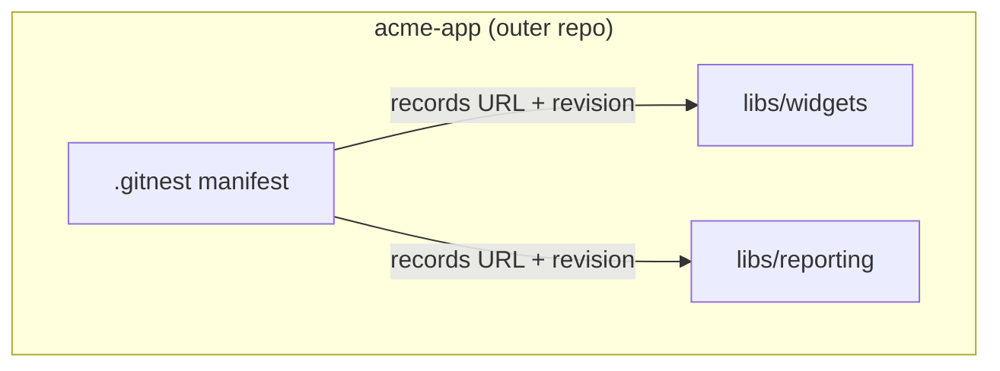
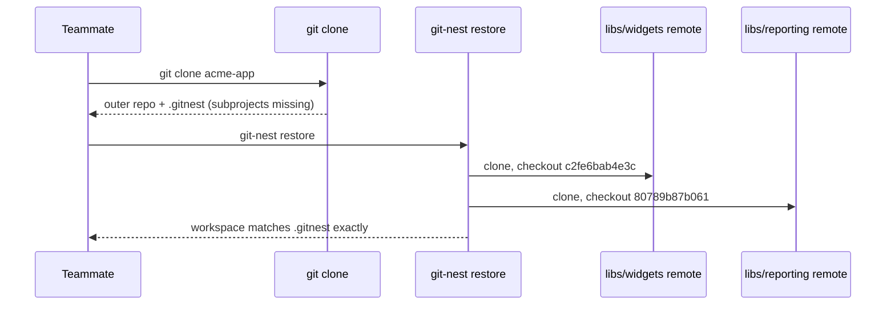
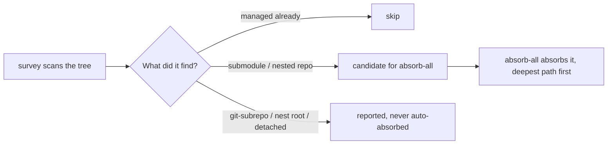
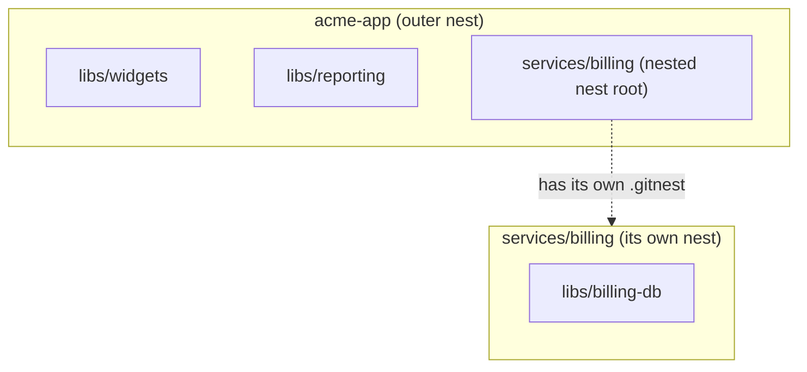
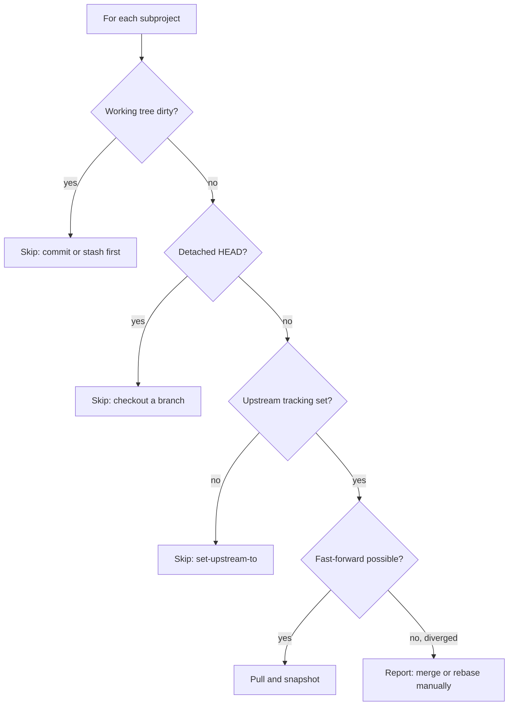

# git-nest Examples

Walkthroughs of common git-nest workflows: a scenario sketch, then the real commands and the output they produce. All transcripts were captured from an actual scratch workspace running these exact commands (some incidental Git chatter -- Windows CRLF notices, detached-HEAD advice -- is trimmed for readability; nothing about git-nest's own output is altered).

The running example is a small product, `acme-app`, made of a couple of shared libraries, some vendored third-party code, and a service that turns out to deserve its own nest.

## Table Of Contents

1. [Start A Brand-New Nest](#1-start-a-brand-new-nest)
2. [Restore A Nest After Cloning](#2-restore-a-nest-after-cloning)
3. [Record Reproducible Revisions With Snapshot](#3-record-reproducible-revisions-with-snapshot)
4. [Absorb An Existing Nested Git Repository](#4-absorb-an-existing-nested-git-repository)
5. [Absorb A Git Submodule](#5-absorb-a-git-submodule)
6. [Absorb A git-subrepo](#6-absorb-a-git-subrepo)
7. [Absorb A Subtree](#7-absorb-a-subtree)
8. [Survey And Absorb Everything At Once](#8-survey-and-absorb-everything-at-once)
9. [Visualize The Nest With Tree](#9-visualize-the-nest-with-tree)
10. [Nest A Nest Inside A Nest](#10-nest-a-nest-inside-a-nest)
11. [Update Subprojects With Pull](#11-update-subprojects-with-pull)
12. [Detach A Subproject](#12-detach-a-subproject)
13. [Inline A Subproject](#13-inline-a-subproject)
14. [Move A Subproject](#14-move-a-subproject)
15. [Iterate Across Subprojects With Foreach](#15-iterate-across-subprojects-with-foreach)
16. [Machine-Readable Output For Scripts](#16-machine-readable-output-for-scripts)
17. [Health-Check A Workspace With Doctor](#17-health-check-a-workspace-with-doctor)

The overall shape this walkthrough builds up to, by section 10:

```
.
+-- libs/
|   +-- reporting/
+-- packages/
|   +-- widgets/
+-- services/
|   +-- billing/
|       +-- libs/
|           +-- billing-db/
+-- vendor/
    +-- analytics-sdk/
    +-- ui-kit/
```

(That is real `git-nest tree --recursive` output from the same scratch workspace these examples were captured in -- see section 9.)

## 1. Start A Brand-New Nest

**Scenario:** `acme-app` is a fresh Git repository. It needs two shared libraries, `widgets` and `reporting`, tracked as independent repositories rather than copied in.



**Commands and output:**

```console
$ git init
$ git add -A && git commit -m "Initial commit"

$ git-nest init
Initialized git-nest workspace.

$ git-nest add https://example.invalid/widgets.git libs/widgets
Cloning into 'libs/widgets'...
Added subproject libs/widgets.

$ git-nest add https://example.invalid/reporting.git libs/reporting
Cloning into 'libs/reporting'...
Added subproject libs/reporting.

$ cat .gitnest
# git-nest manifest

[project]
version=1

[subproject "libs/widgets"]
repo=https://example.invalid/widgets.git
target_branch=main
revision=c2fe6bab4e3c2069630dbf2aa7f37cdee5c4047c

[subproject "libs/reporting"]
repo=https://example.invalid/reporting.git
target_branch=main
revision=80789b87b06198f107c9e2a9470983deda44cd10

$ git-nest status
outer branch: main
subprojects:
  libs/widgets: pinned c2fe6bab4e3c
  libs/reporting: pinned 80789b87b061

$ git add .gitnest .gitignore .gitattributes
$ git commit -m "Add libs/widgets and libs/reporting"
```

`init` also wrote `.gitignore` (so the outer repository never accidentally tracks subproject files) and `.gitattributes` (so `.gitnest` always uses LF line endings). Both are committed alongside the manifest.

## 2. Restore A Nest After Cloning

**Scenario:** a teammate clones `acme-app` on a second machine. The subproject directories do not exist yet -- only `.gitnest` records what belongs there.



**Commands and output:**

```console
$ git clone acme-app-remote.git acme-app-clone
$ cd acme-app-clone

$ ls libs
ls: cannot access 'libs': No such file or directory

$ git-nest restore
Cloning into 'libs/widgets'...
HEAD is now at c2fe6ba Initial widgets
Restored libs/widgets.
Cloning into 'libs/reporting'...
HEAD is now at 80789b8 Initial reporting
Restored libs/reporting.

$ git-nest status
outer branch: main
subprojects:
  libs/widgets: pinned c2fe6bab4e3c
  libs/reporting: pinned 80789b87b061
```

`restore` checks out each subproject in detached-HEAD state at the exact recorded revision -- that pinned commit *is* the reproducibility contract, not "whatever the branch currently points at."

## 3. Record Reproducible Revisions With Snapshot

**Scenario:** work happens inside `libs/widgets` like any ordinary Git repository. Once it is committed and pushed, `git-nest snapshot` pins the outer manifest to that new commit.

```console
$ cd libs/widgets
$ echo "class Widgets; VERSION = 2; end" > widgets.rb
$ git add -A && git commit -m "Bump widgets version"
$ cd ../..

$ git-nest snapshot
Warning: cannot snapshot libs/widgets at f13f70984cfe: commit is not reachable from origin or a local tag
Snapshot unchanged for libs/reporting at 80789b87b061.
Refreshed git-nest snapshot.
```

`snapshot` refuses to pin an unpushed commit -- if the outer repository recorded it and nobody else had that commit, `restore` would fail for everyone else. Push first, then snapshot succeeds:

```console
$ git -C libs/widgets push origin HEAD:main

$ git-nest snapshot
Snapshotted libs/widgets at f13f70984cfe.
Snapshot unchanged for libs/reporting at 80789b87b061.
Refreshed git-nest snapshot.

$ git add .gitnest
$ git commit -m "Snapshot libs/widgets after version bump"
```

## 4. Absorb An Existing Nested Git Repository

**Scenario:** someone already ran a plain `git clone` of the `analytics-sdk` repository into `vendor/analytics-sdk` before the project adopted git-nest. It is a real, independent Git repository sitting there unmanaged.

```console
$ git clone https://example.invalid/analytics-sdk.git vendor/analytics-sdk
$ git -C vendor/analytics-sdk remote -v
origin	https://example.invalid/analytics-sdk.git (fetch)
origin	https://example.invalid/analytics-sdk.git (push)

$ git-nest absorb vendor/analytics-sdk
Absorbed nested-repo vendor/analytics-sdk as a git-nest subproject at 2fdcda86f250 (remote https://example.invalid/analytics-sdk.git).

$ git add .gitnest .gitignore
$ git commit -m "Absorb vendor/analytics-sdk"
```

`absorb` auto-detects the source (here, a standalone nested repository) and records its own origin remote and current commit. Nothing about the checkout itself changes -- it keeps its full history.

## 5. Absorb A Git Submodule

**Scenario:** `vendor/ui-kit` was added the traditional way, as a Git submodule.

```console
$ git submodule add https://example.invalid/ui-kit.git vendor/ui-kit
$ git commit -m "Add ui-kit as a submodule"

$ cat .gitmodules
[submodule "vendor/ui-kit"]
	path = vendor/ui-kit
	url = https://example.invalid/ui-kit.git

$ git-nest absorb vendor/ui-kit
Absorbed submodule vendor/ui-kit as a git-nest subproject at 29cfed35fe97 (remote https://example.invalid/ui-kit.git).

$ cat .gitmodules
cat: .gitmodules: No such file or directory

$ git add -A
$ git commit -m "Absorb vendor/ui-kit submodule into the nest"
```

Absorbing a submodule converts it into a standalone managed subproject: its `.git` directory is relocated out of `.git/modules/`, the submodule wiring is removed from `.gitmodules` (deleting that file entirely once it is empty), and it becomes an ordinary git-nest subproject with its own remote.

## 6. Absorb A git-subrepo

**Scenario:** `vendor/legacy-tool` was vendored with [git-subrepo](https://github.com/ingydotnet/git-subrepo), which leaves a `.gitrepo` marker file recording its upstream.

```console
$ cat vendor/legacy-tool/.gitrepo
[subrepo]
	remote = https://example.invalid/legacy-tool.git
	branch = main
	commit = 5e2a...
	parent = 91cd...
	method = merge
	cmdver = 0.4.6

$ git-nest absorb --subrepo vendor/legacy-tool
Absorbed subrepo vendor/legacy-tool as a git-nest subproject at 4ba16c1f389e (remote https://example.invalid/legacy-tool.git).
The upstream merge/split history recorded in the former .gitrepo file was not preserved.

$ ls vendor/legacy-tool
legacy_tool.py
```

`--subrepo` reads the remote and branch straight out of `.gitrepo`, then removes that file: the directory becomes a plain managed subproject. This is a forward-only conversion -- the merge/split history git-subrepo tracked is not reconstructed, only the files as they exist right now.

Unlike the previous two sources, this is never auto-detected: a directory with `.gitrepo` still looks like an ordinary tracked directory to plain `absorb`, so `--subrepo` must be requested explicitly.

## 7. Absorb A Subtree

**Scenario:** `vendor/theme` was vendored with `git subtree add --squash`. Unlike a submodule or a git-subrepo, a merged subtree leaves **no marker at all** -- there is nothing on disk to detect.

```console
$ ls -a vendor/theme
.  ..  theme.scss

$ git-nest absorb --subtree vendor/theme https://example.invalid/theme.git
Absorbed subtree vendor/theme as a git-nest subproject at 647d0ce5408d (remote https://example.invalid/theme.git).
Prior subtree history was not carried across.
```

Because nothing marks a subtree, the remote URL is mandatory -- there is nothing to read it from. Like `--subrepo`, this is forward-only and never auto-detected.

## 8. Survey And Absorb Everything At Once

**Scenario:** `services/billing` was cloned by hand and never registered. Rather than absorbing it one path at a time, first see what is out there, then bring it all in.



```console
$ git clone https://example.invalid/billing.git services/billing

$ git-nest survey
Unmanaged repositories discovered under the current nest:
  R  services/billing             nested-repo  run git-nest absorb services/billing to manage it

$ git-nest absorb-all --dry-run
Would absorb 1 subproject(s):
  would absorb services/billing into the nest

$ git-nest absorb-all
Absorbed 1 subproject(s):
  services/billing (nested-repo) at 04dd3bf8a2ff

$ git add -A
$ git commit -m "Absorb services/billing via absorb-all"
```

`absorb-all` reuses `survey`'s own scan, so the two commands never disagree about what is out there. It only ever absorbs submodules and nested repos (the `S` and `R` codes) -- git-subrepos and subtrees always require the explicit, conscious `absorb --subrepo`/`--subtree` shown above. If a batch absorbs several paths and one fails partway through, every absorb already done in that run is rolled back by default (`--force-partial` keeps the successful ones instead).

## 9. Visualize The Nest With Tree

**Scenario:** after all of the above, get a quick overview instead of reading `.gitnest` by hand.

```console
$ git-nest tree
.
+-- libs/
|   +-- reporting/
|   +-- widgets/
+-- services/
|   +-- billing/
+-- vendor/
    +-- analytics-sdk/
    +-- legacy-tool/
    +-- theme/
    +-- ui-kit/
```

Managed subprojects sharing a path prefix (`libs/widgets`, `libs/reporting`) group under one branch. Add `--all` to also see `survey`'s own unmanaged findings, each marked with its code so managed and unmanaged entries are never ambiguous:

```console
$ git-nest tree --all
.
+-- external/
|   +-- other/  [R] nested-repo
+-- libs/
|   +-- reporting/
|   +-- widgets/
+-- services/
|   +-- billing/
+-- vendor/
    +-- analytics-sdk/
    +-- legacy-tool/
    +-- theme/
    +-- ui-kit/
```

`tree` uses a single `+--` connector for every branch (never a different glyph for the last child of a level) and a trailing `/` on every entry, since everything a git-nest tree shows is a directory; no Unicode box-drawing characters, so its output renders identically -- and pastes cleanly -- in any terminal, editor, or chat.

## 10. Nest A Nest Inside A Nest

**Scenario:** `services/billing` turns out to need its own database-schema repository. Rather than flattening it into the outer nest, `services/billing` becomes a nest of its own.



```console
$ cd services/billing
$ git-nest init --sure
Initialized git-nest workspace.

$ git-nest add https://example.invalid/billing-db.git libs/billing-db
Cloning into 'libs/billing-db'...
Added subproject libs/billing-db.

$ git add .gitnest .gitignore .gitattributes libs
$ git commit -m "Turn services/billing into its own nested nest"
$ cd ../..

$ git-nest tree --recursive
.
+-- libs/
|   +-- reporting/
|   +-- widgets/
+-- services/
|   +-- billing/
|       +-- libs/
|           +-- billing-db/
+-- vendor/
    +-- analytics-sdk/
    +-- ui-kit/
```

`init --sure` is required here on purpose: creating a nest inside a directory that is already part of another nest is exactly the kind of accident git-nest tries to prevent, so it must be a conscious, explicit choice. Plain `git-nest tree` (without `--recursive`) would show `services/billing` as an ordinary leaf; only `--recursive` descends into it and renders its own subprojects nested underneath.

A related, rarer case is refused with no override at all: if `services/billing` had a deeper path already registered as a subproject by the *outer* nest (only possible if `services/billing` was given its own `.git` after that registration, retroactively), `init --sure` would refuse, naming the conflict and the exact fix -- `detach` the subproject from the outer nest, retry `init` here, then `absorb` it back into the new inner nest.

## 11. Update Subprojects With Pull

**Scenario:** several subprojects have moved upstream since they were last touched. `pull` fast-forwards what it safely can and reports the rest without guessing.



```console
$ git-nest pull
Pulled libs/reporting to d9c90517bfb3.
libs/widgets: already up to date.
vendor/analytics-sdk: already up to date.
vendor/ui-kit: already up to date.

=== Pull Summary ===
  Pulled:        1
  Skipped (no upstream tracking):
    vendor/legacy-tool (run: git -C vendor/legacy-tool branch --set-upstream-to=origin/main)
    vendor/theme (run: git -C vendor/theme branch --set-upstream-to=origin/main)
  Diverged (not fast-forward):
    services/billing (run: git -C services/billing merge origin/<branch> or git -C services/billing rebase origin/<branch>)
Notice: nested project found at services/billing; rerun with --recursive to include it
```

Every category lists the actual subproject path with a concrete fix-it command -- never just a count. `pull` never force-merges a diverged subproject; it reports the exact command to resolve it by hand. By default `pull` only touches subprojects; add `--sure` to also pull the nest root itself, and `--recursive` to additionally descend into nested nests like `services/billing` above.

## 12. Detach A Subproject

**Scenario:** `vendor/theme` should stop being managed by the nest, but the checkout should stay right where it is -- maybe it is about to be moved to a different repository entirely.

```console
$ git-nest detach vendor/theme
Detached vendor/theme from .gitnest; kept files and kept vendor/theme/ ignored.
After you move or delete vendor/theme, run git-nest repair to prune its ignore entry.

$ git -C vendor/theme remote -v
origin	https://example.invalid/theme.git (fetch)
origin	https://example.invalid/theme.git (push)

$ git-nest status --porcelain | grep theme
U	vendor/theme	unmanaged	-	-	-	nested-git-repo
```

The manifest entry is gone, but `vendor/theme` is still a complete, independent Git repository on disk -- `detach` is the opposite of absorbing an existing repo (section 4). The remote is never touched by either direction.

## 13. Inline A Subproject

**Scenario:** `vendor/legacy-tool` is small enough that it no longer deserves its own repository; dissolve it into ordinary tracked files in the outer repo.

```console
$ git-nest inline vendor/legacy-tool --dry-run
Error: vendor/legacy-tool has local-only branch tip main; push or remove local-only work before inline
```

`inline` refuses to discard commits nobody else has -- exactly like `snapshot` refusing to pin an unpushed commit in section 3. Push first:

```console
$ git -C vendor/legacy-tool push origin HEAD:main

$ git-nest inline vendor/legacy-tool --commit --message "Inline vendor/legacy-tool into the outer repo"
Inlined vendor/legacy-tool into the outer repository; remote https://example.invalid/legacy-tool.git was not changed.

$ test -d vendor/legacy-tool/.git && echo "still has its own .git" || echo "no .git -- ordinary outer-repo files now"
no .git -- ordinary outer-repo files now
```

`inline` is the opposite of absorbing outer-repository files: the subproject's own Git history is discarded (a transient recovery backup is made first, in case the conversion is interrupted), but its current files land in the outer repository as ordinary tracked content. The remote itself is left untouched, same as `detach`.

## 14. Move A Subproject

**Scenario:** `libs/widgets` is renamed to `packages/widgets` as part of a larger reorganization.

```console
$ git-nest move libs/widgets packages/widgets
Moved subproject libs/widgets to packages/widgets.

$ git-nest tree
.
+-- libs/
|   +-- reporting/
+-- packages/
|   +-- widgets/
+-- services/
|   +-- billing/
+-- vendor/
    +-- analytics-sdk/
    +-- ui-kit/

$ git add -A
$ git commit -m "Move libs/widgets to packages/widgets"
```

`move` (alias `mv`) updates the manifest and the managed `.gitignore` entry together, and refuses to run if the destination would collide with an existing subproject or differ from one only by letter case.

## 15. Iterate Across Subprojects With Foreach

**Scenario:** run an arbitrary command across every checked-out subproject, or restrict it to the ones with local changes.

```console
$ git-nest foreach -- git log -1 --oneline
f13f709 Bump widgets version
2fdcda8 Initial analytics-sdk
29cfed3 Initial ui-kit
f43d669 Turn services/billing into its own nested nest
d9c9051 Bump reporting version

$ echo "hello" >> packages/widgets/widgets.rb

$ git-nest foreach-modified --porcelain
F	packages/widgets	modified	-	-	-	dirty
```

`foreach` never touches the nest root itself -- only checked-out subprojects. `foreach-modified`/`foreach-clean` narrow the same iteration to dirty or clean subprojects respectively, and are the building blocks for the cross-repository feature-branch recipe documented in the main README (branch, commit, and push every dirty subproject in one pass, then `git-nest snapshot` to pin the result).

## 16. Machine-Readable Output For Scripts

**Scenario:** a script needs the current subproject inventory as structured data instead of a human table.

```console
$ git-nest list --json-pretty
{
    "version": 1,
    "command": "list",
    "recursive": false,
    "ok": true,
    "subprojects": [
        {
            "code": "R",
            "path": "libs/reporting",
            "state": "clean",
            "target": "main",
            "current": "d9c90517bfb3ef45cacf90cf12fa97480fc444e2",
            "expected": "-",
            "detail": "https://example.invalid/reporting.git"
        },
        {
            "code": "R",
            "path": "packages/widgets",
            "state": "clean",
            "target": "main",
            "current": "f13f70984cfe8316def8ca212e9c9c196ad277ca",
            "expected": "-",
            "detail": "https://example.invalid/widgets.git"
        }
    ],
    "errors": [],
    "warnings": []
}
```

Every inspection command (`status`, `verify`, `outdated`, `diff`, `list`, `tree`, `survey`, `doctor`) and every mutating command (`absorb`, `absorb-all`, `inline`, `detach`, `remove`, `pull`) shares this same envelope and the same seven-column row shape (`code`, `path`, `state`, `target`, `current`, `expected`, `detail`), versioned in `schemas/git-nest-output-v1.schema.json`. `--porcelain` gives the same rows as stable, tab-separated text for shell scripts that would rather not parse JSON.

## 17. Health-Check A Workspace With Doctor

**Scenario:** before relying on a workspace (in CI, or after a long time away from a project), check that everything git-nest depends on is actually in place.

```console
$ git-nest doctor --offline
I	git-version	git 2.55.0.windows.3; minimum supported version is 2.20
I	shell	running under sh
I	manifest	.gitnest is present and parseable
I	lock	no manifest lock present
I	gitattributes	git-nest attributes guard present
I	gitignore-stale	no stale nest-owned ignore entries
I	recovery-backup	no interrupted conversion backups
I	remotes	remote reachability skipped by --offline
I	git-filter-repo	not found; required only for absorb --preserve-history
I	export-tar	available; required for export --format tar.gz
I	export-zip	python available; required for export --format zip
```

`doctor` never modifies anything. By default it also contacts each subproject's remote to confirm reachability; `--offline` skips that (useful when there is no network, or in a fast pre-flight check). `--exit-code` makes it fail a CI step on any warning or error instead of just reporting them.
